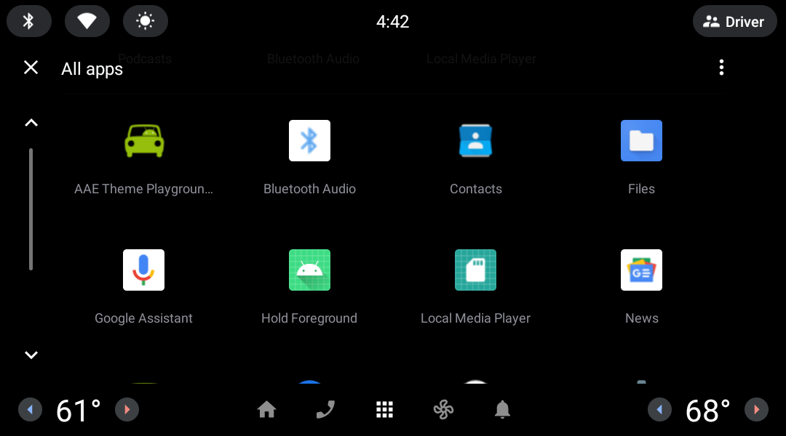
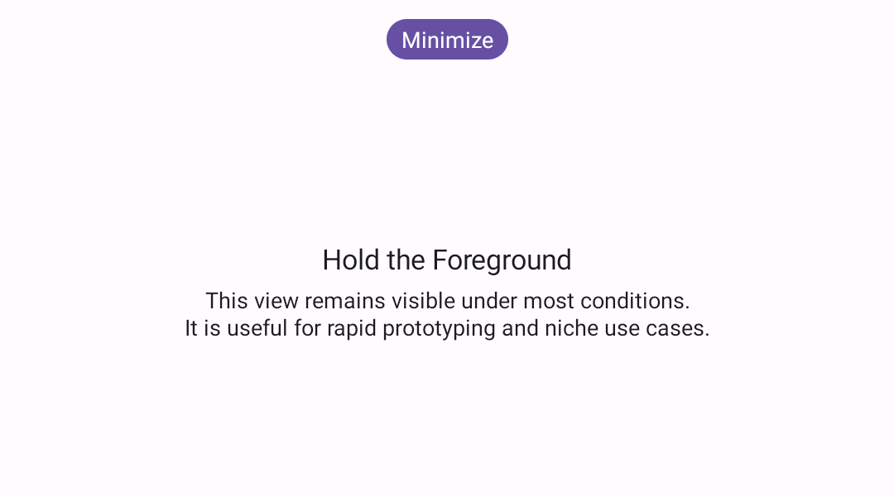
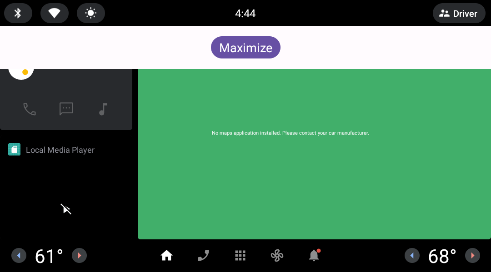

This repo contains an Android app implementation that satisfies some relatively uncommon requirements. Although the app behavior would be dangerous or disruptive on a personal device, it is useful in the context of manufacturing, retail, etc. Think of it as a proof of concept.

# Features
1. GUI fills the primary display completely
2. GUI remains in the foreground and blocks other apps from becoming visible
3. Starts automatically on boot*
4. Recovers from a crash automatically**

\* Due to Android-security restrictions, the app must be manually started initially after installation.
<br>\*\* Android OS includes countermeasures against against crash loops (i.e. backoff delay).

# Requirements
**Non-Functional Requirements**
1. Compatible with Android 12L, 13, and 14
2. Integrated as a userspace app (as opposed to a privileged system app which is typically built into the Android-based platform itself)
3. Discourage the OS from killing the app in the event of memory and/or CPU pressure*
4. Implemented in Kotlin
5. GUI implemented Jetpack Compose

\* Note that 100% availability would require integration as a privileged system app

**Functional Requirements**
1. Fill all available screen real estate on the primary display
2. Prevent other apps from becoming visible (even if the other app is launched programmatically)
3. Initialize when the system starts
4. In the event of a crash, the GUI should reappear within a moment

# Developer Customization
In order to be open for extension and closed for modification (i.e. open-closed principle), developers are encouraged to change the following files to suite different needs. Note that interfaces and superclasses are provided.
1. Change overlay appearance and behavior
   <br>[CustomComposeView.kt](app/src/main/java/com/example/holdforeground/CustomComposeView.kt) and any composables referenced inside
2. Change notification appearance and behavior
   <br>[HoldForegroundService.kt](app/src/main/java/com/example/holdforeground/HoldForegroundService.kt)
3. Change app icon and name
   <br>[Drawables and String resources](app/src/main/res)

# Build and Install
Note that some runtime permissions are required. However, this implementation does not include runtime prompts. Suggestion is to leverage the `-g` flag when installing the APK. This ensures that permissions are granted at install time.

Recommendation is to use Android Studio - which can leverage a custom build configuration stored in the repo at [app.run.xml](.run/app.run.xml). Details of how to do this are not the focus of this documentation.

# Operation

## Command Line User Interface
The following user interface is available for testing purposes.

1. Start the service
   ```
   adb shell am start-foreground-service com.example.holdforeground/.DaemonService
   ```
2. Show the GUI
   ```
   adb shell am start-foreground-service -a ACTION_SHOW com.example.holdforeground/.DaemonService
   ```
3. Dismiss the GUI
   ```
   adb shell am start-foreground-service -a ACTION_DISMISS com.example.holdforeground/.DaemonService
   ```

## Graphical User Interface
A reference implementation is included to hint at what is possible. In addition to the features mentioned above, it implements the following:
1. Briefly describes the app itself
2. User can tap a button to "minimize" the size of the overlay, thereby revealing content underneath
3. User can tap a button to "maximize" the overlay size to full screen
4. While minimized, user can interact with underlying content (within its visible bounds)

A video is available at [holdforeground_demo.mp4](doc/holdforeground_demo.mp4)

| Launcher icon | Maximized | Minimized |
| :---: | :---: | :---: |
|  |  |  |

# Testing
Simulate a crash
```
adb shell am crash com.example.holdforeground
```
# Known Issues
1. On an Android 12L device, when the app loads initially (e.g. after reboot), the system bars may not hide as expected. To recover and hide the system bars, tap one of the navigation icons like Home or the App Drawer. Note that this issue is not present on Android 13. 

# Reuse Opportunities
1. [DaemonService.kt](app/src/main/java/com/example/holdforeground/daemon/DaemonService.kt)
